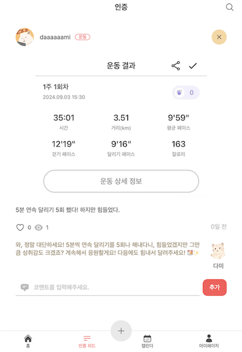

# 주요 기능

## AI 응원 메시지 생성

사용자가 일상적인 습관이나 챌린지에 대한 **인증 기록**을 올리면, AI가 이를 분석하여 **따뜻한 응원 메시지**를 생성하고 코멘트로 달아줍니다.

- 프롬프트 엔지니어링을 통해 글과 이미지를 분석하고 그에 알맞는 메시지를 만들고 추후 고도화를 대비하여 확장성을 가진 open AI를 채택하였습니다.
- OpenAI의 GPT API를 사용해 사용자 인증 데이터를 분석하고, 자동으로 메시지를 생성합니다.
- 이 AI 메시지는 Supabase Realtime을 통해 실시간으로 사용자의 화면에 표시되며, 메시지 등록 상태도 확인 가능합니다.
- 시스템 문구는 AI의 캐릭터 역할을 반영한 설정으로, 예를 들어 AI가 사용자에게 항상 긍정적이고 기운을 북돋아주는 메시지를 전달하도록 세팅되었습니다. 사용자마다 성격이나 기록 스타일이 다르기 때문에, AI는 이를 인식하고 메시지를 맞춤형으로 제공합니다.

| 업로드 과정 및 AI 코멘트 받기  | 결과물                                     |
| ------------------------------ | ------------------------------------------ |
|  |  |

## 인증 기록 관리 및 시각화

사용자가 기록한 **인증 데이터**를 효과적으로 관리하고 시각화하여, 자신의 진척 상황을 쉽게 확인할 수 있는 기능을 구현했습니다.

- **캘린더 형식**: 사용자가 일상적으로 인증한 기록들을 **캘린더** 형식으로 제공하여, 어느 날에 어떤 기록을 했는지 시각적으로 한눈에 확인할 수 있습니다.
  - **date-fns** 라이브러리를 사용해 날짜 계산 및 인증 기록의 분류 작업을 처리하며, 사용자들이 원하는 날짜나 기간별로 기록을 검색할 수 있도록 기능을 확장했습니다.
- **카테고리별 인증 확인**: 사용자가 가장 많이 인증한 **카테고리**를 메인 페이지에서 보여줍니다. 이 기능을 통해 사용자들이 자신의 기록을 주제별로 쉽게 파악하고, 자신의 성취를 강화할 수 있습니다.

| 제일 인증 수가 많은 카테고리               | 전체 인증                       | 캘린더로 확인하는 나의 인증      | 내가 작성한 모든 인증                | 검색으로 인증 찾기           |
| ------------------------------------------ | ------------------------------- | -------------------------------- | ------------------------------------ | ---------------------------- |
|  |  |  |  |  |

## 편리한 소셜 로그인

카카오 로그인 기능을 추가하여 회원가입 절차 없이 빠르게 서비스에 접근할 수 있습니다.

## 기타

- **무한스크롤링** : 인증 기록 리스트는 무한 스크롤링으로 확인할 수 있습니다.
- **다양한 폼에대한 유효성 검증** : 사용자가 입력하는 폼들에 대해서 실시간 유효성 검증을 진행하여 메시지를 통해 알려줍니다.
