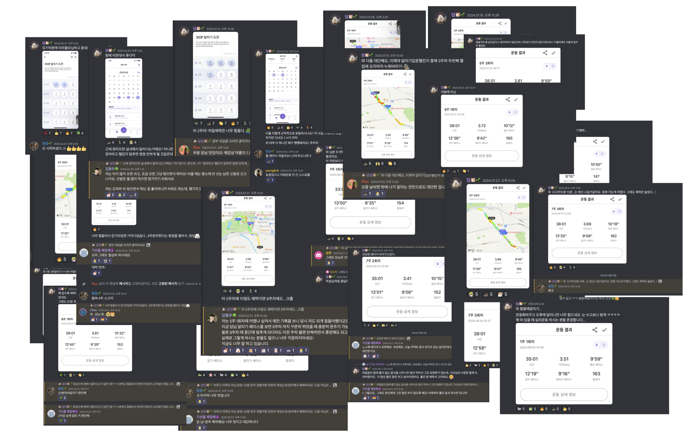

# 소개

기록에 대한 따뜻한 응원을 AI 메시지로 전달하는 서비스

- 2024.08 ~ 진행 중
- [Github](https://github.com/j2h30728/boost-pal?tab=readme-ov-file#boost-pal--%EB%B6%80%EC%8A%A4%ED%8A%B8-%ED%8C%94)
- [배포 링크](https://boostpal.vercel.app/)
- 기술 스택
  - 프론트엔드 : Next.js (app), TypeScript, tailwind-css, zod, react-hook-form, Supabase-realtime
  - 백엔드 : Prisma, Supabase, open AI, AWS SQS + Lambda, Iron-session, Cloudflare Image
- 디자인 기획 : [피그마](https://www.figma.com/design/LKzdjcOImadOrk1TC5cJ9Q/dam?node-id=0-1&t=k8Yrve9qtzBlOAuf-1)

## [BOOST PAL 바로가기](https://boostpal.vercel.app/)

> 사용자가 일상적인 **습관과 챌린지에 대한 기록**을 남기면, 
> 사용자가 작성한 글과 이미지를 바탕으로 **OpenAI가 생성한 응원 메시지가 코멘트**로 추가됩니다. 
> 이를 통해, 지속적인 활동과 **동기부여**를 제공할 수 있도록 돕습니다.

## 프로젝트 개발 계기

### 주요 이용자(페르소나)

- 루틴을 만들고 싶지만 동기부여가 어려운 사람
- 누군가와 함께 습관을 만들어 나가고 싶은 사람
- 작은 성취를 기록하고 저장하고 싶은 사람
- 누군가의 응원과 위로가 필요한 사람

### 해결하고 싶은 문제

- **개인의 관점**: 작은 성취를 꾸준히 쌓아 궁극적으로 원하는 활동을 유지하는 것
- **타인의 관점**: 인증 기록을 공유하면 타인과의 비교가 발생하지만, BoostPal에서는 오로지 나만의 성취에 집중

싫어하고 힘들어하던 운동을, 지속적인 기록과 사람들의 응원과 위로를 통해 달리기 챌린지 완주 뿐만 아니라, 취미 생활로 갖게 되었습니다. 
이 경험으로 어떤 인증을 기록해도 응원하는 AI와 기록 저장을 벤치마킹 했습니다. 

시작하는 것과 꾸준히 하는 것은 너무 어렵습니다. 하지만, 누군가가 함께 응원해준다면 이를 지속할 수 있는 힘이 생긴다는 것을 믿습니다. 
한 명이라도 쓸 수 있는, 쓰고 싶어하는 서비스를 만들고 싶었습니다. 지금 이 서비스의 고객은 개발자인 저를 타겟팅합니다.

| 실제로 진행한 달리기 인증 기록과 응원 코멘트, 이모지 | 챌린지 완주한 기록                   |
| ---------------------------------------------------- | ------------------------------------ |
|                    |  |

## 핵심 기능

### 귀여운 동물의 응원 코멘트를 받아보세요

> 기록 하고싶은 인증의 이미지와 내용들을 입력하고 그에 대한 AI 기반 응원 코멘트로 동기부여를 받아보세요. 
> 다른 사용자의 인증에 호응하며, 서로를 복돋아줄 수 있습니다.

| 업로드 과정 및 AI 코멘트 받기  | 결과물                                     |
| ------------------------------ | ------------------------------------------ |
|  |  |

### 다양한 방식으로 인증 기록들을 확인해보세요

> - 인증 횟수가 제일 많은 주제를 메인페이지에서 확인 할 수 있습니다.
> - 캘린더 형식으로 꾸준한 인증을 한 눈에 확인해보세요.
> - 인증 내용을 검색할 수 있습니다.

| 제일 인증 수가 많은 카테고리               | 전체 인증                       | 캘린더로 확인하는 나의 인증      | 내가 작성한 모든 인증                | 검색으로 인증 찾기           |
| ------------------------------------------ | ------------------------------- | -------------------------------- | ------------------------------------ | ---------------------------- |
|  |  |  |  |  |

### 제일 인증 수가 많은 카테고리

서비스의 전체 카테고리에서 인증 수가 많은 카테고리의 인증 글을 확인해보세요.

### 전체 인증

카테고리와 상관없이 최신글 순으로 인증 글들을 확인 할 수 있습니다. 
무한 스크롤링으로 끊김 없이 확인해 보세요.

### 캘린더로 확인하는 나의 인증

한 달 동안 내가 올린 인증 활동들을 한 눈에 확인해보세요. 
인증을 올린 날을 캘린더로 확인하고 달마다 트래킹할 수 있습니다.

### 내가 작성한 모든 인증

내가 올린 인증글을 모아서 한 번에 확인해보세요! 
AI에게 받은 응원댓글을 함꼐 확인해 동기부여와 자극을 받을 수 있습니다.

### 검색으로 인증 찾기

글의 키워드만 생각난다면 검색기능을 활용해 보세요!

## 유저 플로우

## 기술 스택

