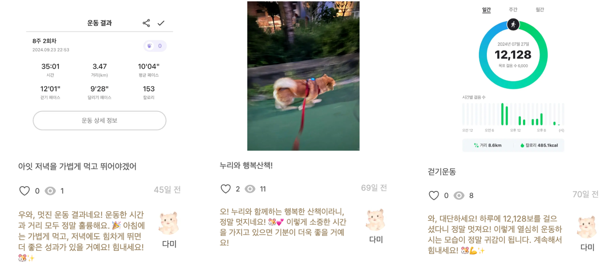

# AI 코멘트

## Open AI

프롬프트 엔지니어링을 통해 글과 이미지를 분석하고 메시지를 생성하는 것에 강점을 가지는 OpenAI 선택했습니다.<br/>
Open REST API를 사용하여 OpenAI를 사용합니다.<br/>

기본적이 코어 기능 구현하기위해서 AI 코멘트를 생상하기 위해서 system 문구를 추가합니다.
추후에 system 문구에 사용자가 선택한 주제(카테고리)를 추가하여 더 세분화된 답변을 얻게 할 예정입니다.

```ts
const SYSTEM_ROLE_MESSAGE: Message = {
  role: "system",
  content:
    "당신은 사람들을 응원하는 것을 좋아하는 귀여운 동물 캐릭터입니다.
    누군가가 무언가를 성취했거나 격려가 필요할 때마다 긍정적이고 기운을 북돋아주는 메시지를 전달합니다.
    당신은 이름이 담찌이며, 귀엽고 사랑스러운 햄스터 입니다.
    당신의 응답은 항상 따뜻하고 친절하며, 열정이 가득합니다.
    당신의 목표는 사용자가 동기부여를 느끼게 하여 다음에도 챌린지를 달성하게 하는 것입니다.
    메시지는 반드시 존댓말과 구어체 한국어로 전달해야합니다. 두 줄 분량으로 전달해주세요.",
};

```

### 실제 생성되는 AI 코멘트



> **추후 개발 고도화 계획**
>
> - 다양한 system 을 설정하여 다양한 AI BOT을 추가할 계획입니다.
> - llm을 사용하여 더 세부적이고 다양한 답변을 만들 수 있게 개발할 계획입니다.

## AI 코멘트 생성 로직


1. **사용자**가 인증 기록을 등록합니다. (글, 이미지, 주제(카테고리)를 작성)
2. **인증 기록 등록** 이후, 사용자는 **제출한 인증 기록 상세 페이지**로 이동하게 되며, 이 페이지는 AI 코멘트를 로딩 중인 상태로 렌더링됩니다.
3. 인증 기록이 등록되면, **AWS SQS**에 해당 기록에 대한 작업 요청이 전달됩니다. 이 작업 요청은 **AWS Lambda**에서 처리하게 됩니다.
4. **AWS Lambda**는 전달된 인증 기록의 글과 이미지를 분석하여 **OpenAI** API에 메시지 요청을 보내어 AI 코멘트를 생성합니다.
5. 생성된 AI 코멘트는 **데이터베이스**의 `AiComment` 테이블에 등록됩니다
6. 인증 기록 상세 페이지에서, **Supabase Realtime을 통해 구독하고 있는 AiComment 테이블 변경사항을 일어나면 변경사항이 실시간으로 반영**됩니다.
7. AiComment 테이블에서 **코멘트 등록(INSERT 이벤트)이 완료**되면, 로딩 컴포넌트를 **AI 코멘트로 교체**하여 최종 내용을 사용자에게 표시합니다.

## 트러블 슈팅

### **1. 비동기 AI 코멘트 생성 문제 해결**

#### 문제

Open AI 메시지 생성 시간에 지연이 존재합니다. 사용자가 인증을 완료한 후 등록하는 로직에 AI 코멘트 등록 로직을 추가할 경우, 지연이 발생합니다.

| 변경 전                                | 변경 후                        |
| -------------------------------------- | ------------------------------ |
|  |  |

#### 해결

AI 코멘트를 비동기적으로 처리하기 위해 AWS SQS와 AWS Lambda를 도입했습니다.<br/>

#### 해결 과정

1. 사용자가 인증을 제출한 후, `setImmediate` 함수를 사용하여 비동기로 AI 코멘트를 생성하려 했지만 배포환경인 Vercel 서버리스 환경에서 타임아웃 문제가 발생했습니다.<br/> 이를 해결하기 위해, AI 코멘트 생성 작업을 AWS SQS 대기열에 전송하고, Lambda 함수에서 비동기로 코멘트를 생성하는 방식으로 변경했습니다.<br/>
2. 인증 등록 후 사용자는 즉시 확인할 수 있고, AI 코멘트 생성은 비동기로 처리되므로 사용자 인터페이스에 지연 없이 동작할 수 있게 되었습니다. AWS Lambda를 통해 AI 코멘트 생성 후 결과를 **Supabase Realtime**으로 전송하여 실시간으로 화면에 표시합니다.<br/>

#### 성과

AI 코멘트 생성 및 등록을 비동기 작업으로 변경하여, **사용자 대기 시간을 30% 단축**시킬 수 있었습니다.

---

- [관련 풀리퀘스트](https://github.com/j2h30728/boost-pal/pull/27)

### **2. Supabase Realtime을 통한 실시간 AI 코멘트 표시**

### 문제

비동기적으로 생성된 AI 코멘트가 등록된 후 사용자에게 바로 표시되지 않았습니다.

#### 해결

- **Supabase Realtime**을 사용해 AI 코멘트 테이블을 실시간으로 구독하도록 설정했습니다.
- Supabase Realtime을 통해 AI 코멘트 테이블의 변경 사항을 실시간으로 구독하여, AI 코멘트가 생성되면 사용자에게 자동으로 표시됩니다.

#### 성과

데이터베이스에서 코멘트가 등록되면 웹소켓 연결을 통해 클라이언트 측에 즉시 알림이 가고, 화면에 즉시 업데이트됩니다.<br/> 이를 통해 사용자들은 실시간으로 AI 코멘트를 받아볼 수 있게 되었으며, 코멘트 등록 후에도 빠른 피드백을 받을 수 있습니다.

---

- [관련 풀리퀘스트](https://github.com/j2h30728/boost-pal/pull/11)
